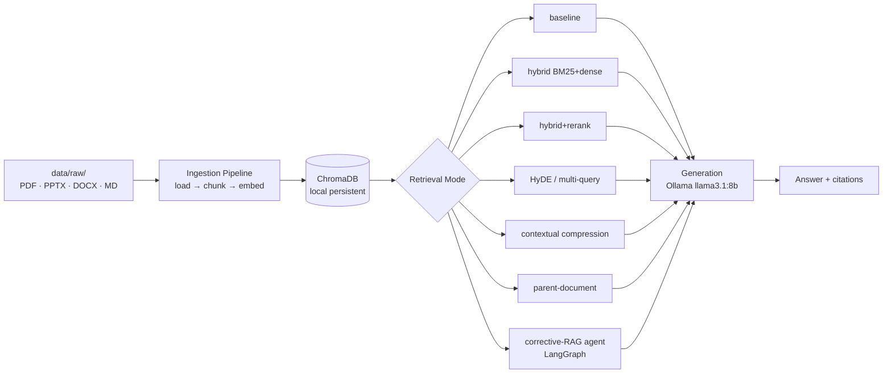

# module-rag

CLI-based RAG system over university module slides and notes.  
Benchmarks 6 retrieval strategies + a corrective-RAG agent. Runs fully offline via Ollama — zero API cost.

---

## Quickstart

```bash
# 1. Install Ollama and pull the model
ollama pull llama3.1:8b

# 2. Install dependencies
make install

# 3. Drop slides/notes into data/raw/, then ingest
make ingest

# 4. Ask a question
make ask Q="What is the difference between supervised and unsupervised learning?"
```

---

## Architecture



---

## Retrieval Modes

| Mode | Technique | Relative cost |
|------|-----------|---------------|
| `baseline` | Chroma similarity search, k=4 | Low |
| `hybrid` | BM25 + dense ensemble (RRF fusion) | Low |
| `hybrid+rerank` | Hybrid top-20 → cross-encoder rerank to top-4 | Medium |
| `hyde` | LLM generates hypothetical answer, embed that | Medium |
| `multiquery` | 3 query variants, deduplicate by chunk_id | Medium |
| `compression` | LLM extracts relevant passages from retrieved chunks | High |
| `parent` | Small child chunks retrieved, large parent chunks returned | Medium |
| `agent` | LangGraph corrective-RAG: route → retrieve → grade → rewrite | High |

Default mode: `hybrid+rerank`

---

## Evaluation Results

> TODO — fill in after Phase 5.

---

## CLI Reference

```bash
module-rag hello                          # smoke test
module-rag ingest --raw-dir data/raw      # ingest documents
module-rag ask "question" --mode agent    # query with a retrieval mode
module-rag ask "question" --show-context  # show retrieved chunks
module-rag eval --modes baseline,hybrid   # run Ragas benchmark
module-rag compare                        # print latest benchmark table
```

---

## Build Phases

- [x] Phase 0 — Project setup
- [ ] Phase 1 — Ingestion pipeline (PDF · PPTX · DOCX · MD)
- [ ] Phase 2 — Baseline RAG (LCEL chain)
- [ ] Phase 3 — Six retrieval techniques
- [ ] Phase 4 — Corrective-RAG agent (LangGraph)
- [ ] Phase 5 — Ragas evaluation
- [ ] Phase 6 — Documentation & write-up

---

## Stack

Python 3.11+ · uv · LangChain · LangGraph · Ollama · sentence-transformers · ChromaDB · Ragas · Typer
